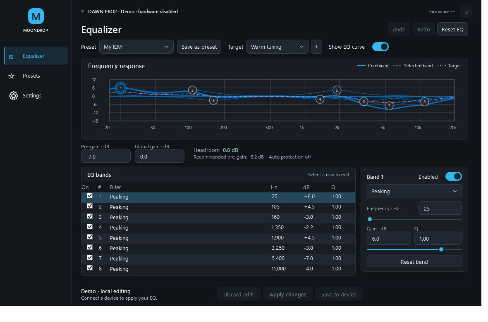

# Moondrop for Windows

Native Windows control app for Moondrop DAWN PRO2 and the original Dawn Pro. The current app uses WPF and .NET 10, with three pages: Equalizer, Presets, and Settings.

Developed and maintained by **[mohammed-just](https://github.com/mohammed-just)**. Based on the original [shaypower/DawnPro-GUI](https://github.com/shaypower/DawnPro-GUI) project.



## Equalizer

- Interactive frequency-response graph, eight-band table, and selected-band editor.
- The default graph shows one combined response with draggable numbered markers. Individual band response lines are an optional setting and are off by default.
- Device identity, firmware, refresh, pre-gain, and global gain in the editing workspace.
- Preset picker, edited indicator, undo/redo, reset, and local preset saving.
- A flat 0 dB target is selected by default. Imported or saved EQ curves can also be selected as a separate target overlay; choosing None hides the target.
- Discard edits, Apply changes, and Save to device are distinct actions.

Editing and opening presets change a local workspace. **Apply changes** writes to the connected device and checks active values through readback. **Save to device** sends the available persistence commands separately. A completed save command does not establish that settings survive power loss; the UI preserves this distinction.

The target overlay compares EQ filter shapes. Acoustic targets such as Harman or diffuse field need compatible headphone measurements and are not supplied as fabricated EQ curves. Hardware bypass and inactive device-slot operations remain unavailable until their behavior is established.

## Presets and settings

Presets are horizontal rows with names, filter counts, Open, Apply, and a secondary menu for rename, duplicate, export, and local deletion. Import supports the validated Equalizer APO text subset and native JSON. Opening a preset does not write to hardware. Apply writes the chosen preset to the active device EQ, retains global gain, and checks readback without saving to device memory. Unstored draft edits are protected before switching presets.

EQ 9 means the active EQ identifier reported by the DAC; it is separate from the eight filter bands and local presets. Click the EQ badge for help. Click the information button beside Save to device for the difference between applying, saving on the DAC, and saving a preset on this PC.

Settings use Appearance, Behavior, EQ, and Advanced groups. Theme, Windows accent, reconnect behavior, remembered editing workspace, preamp protection, curve visibility, and logging are persisted locally. Diagnostics and log export are available here.

## Build on Windows

Install the .NET SDK version pinned in `global.json` (10.0.401), then run from the repository root:

```powershell
dotnet restore DawnPro.Wpf.slnx --locked-mode
dotnet build DawnPro.Wpf.slnx -c Release --no-restore -p:ContinuousIntegrationBuild=true
dotnet test DawnPro.Wpf.slnx -c Release --no-build --settings tests-dotnet/default.runsettings
```

The default test settings exclude physical hardware categories. The ordinary suite covers protocol behavior using fake transports, workspace persistence, hardware failure handling, and actual WPF layout/control behavior without device writes. Physical testing has a separate approval procedure described in [BUILD-DOTNET.md](BUILD-DOTNET.md).

Run without hardware:

```powershell
.\src\Moondrop.Wpf\bin\Release\net10.0-windows\Moondrop.Wpf.exe --demo
```

## Windows release packages

For downloads, choose **Portable** (recommended; .NET included) or **Slim** (smaller; requires .NET 10 Desktop Runtime x64). Both contain the same app, with one executable and license/readme text instead of hundreds of loose DLLs. Extract before launching `Moondrop.exe`.

If Slim lacks a compatible runtime, Microsoft's native Windows launch prompt opens its download page. Run the Desktop Runtime installer and reopen Moondrop. The plain .NET Runtime is insufficient; the SDK is not needed. This prompt does not silently install the runtime or restart the app.

Portable keeps the existing per-user settings location. Its native runtime libraries are extracted into .NET's temporary cache; they do not populate the application folder.

After the restore/build/test commands above, create both packages from the repository root:

```powershell
.\scripts\Build-WindowsRelease.ps1
```

The script uses `Portable.pubxml` and `Slim.pubxml`, builds each in a separate fresh source/output tree with locked dependencies, and verifies preset persistence, all three page captures, the Slim missing-runtime error, and ZIP executable checksums. All app checks disable hardware.

Results are under `artifacts/releases/v<version>`: two named ZIPs, `SHA256SUMS.txt`, and `BUILD-VERIFICATION.json`. Each ZIP contains `Moondrop.exe`, `README.txt`, `LICENSE`, and the `licenses` folder. Build/verification directories are excluded from the ZIPs. Existing output directories are rejected to prevent stale output mixing; select a fresh `-OutputDirectory` for another run. An alternate SDK executable can be selected with `-DotnetPath`.

Portable includes .NET 10.0.12, pinned alongside SDK 10.0.401. Slim retains the normal .NET 10 patch roll-forward and can use an installed compatible Desktop Runtime. WPF trimming is disabled. Compression is enabled only for Portable because .NET does not support it for framework-dependent single-file apps.

Update `global.json`, the Portable runtime pin, and .NET license notices together when taking a newer runtime patch. Re-evaluate package locks intentionally, then verify locked restore and both packages. Bundled runtime fixes require a new Portable build; Slim receives fixes from its installed runtime updates.

This script creates local packages; it does not commit, push, tag, or publish a GitHub release. Physical testing remains subject to the separate NO-GO/approval policy in [BUILD-DOTNET.md](BUILD-DOTNET.md).

## UI verification

The app supports hardware-free captures, for example:

```powershell
.\src\Moondrop.Wpf\bin\Release\net10.0-windows\Moondrop.Wpf.exe --demo --theme=dark --page=Eq --screenshot=artifacts/equalizer.png
```

Supported pages are `Eq`, `Presets`, and `Settings`. `--width=640 --height=620` exercises the narrow layout. `--workspace=<directory>` selects an isolated editing workspace; with `--demo`, it still disables hardware. Raster capture scaling is not a substitute for testing actual Windows display scaling.

See [the redesign completion notes](ui-redesign.md) for the changes and remaining hardware-dependent requirements.
